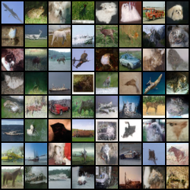

# 生成式模型实现笔记 — DDPM 与 Stochastic Flow Matching

这是CIFAR-10 上从零实现两类基于随机过程的生成模型：

- `diffusion_model_from_scratch/` — DDPM (Ho et al. 2020), ε-prediction, cosine schedule (Nichol & Dhariwal 2021), 1000 步反向采样.
- `flow_matching_from_scratch/` — Stochastic Interpolants (Albergo et al. 2023), velocity + score 联合训练, ODE / SDE 双采样器. 另参考 Flow Matching (Lipman et al. 2023) 与 Score-SDE (Song et al. 2021).

## 成果展示

CIFAR-10 上 DDPM 训练 200 epoch 后的反向采样结果（`scripts/sample_ckpt.py` 产出）：



Flow Matching 的实现与对照实验参见 <https://github.com/xizhe741/flow-matching-from-scratch>。

---

## 1. 统一视角

两类模型共享同一种结构:学一个动力学量 → 由该量确定一个动力系统 → 沿该动力系统采样生成数据。
其中

- diffusion model的关键动力学量是score function，等价于(Ho et al. 2020)给出的ϵ-prediction；
- flow matching的关键动力学量是velocity u_t 。

---

## 2. 共享骨干

### U-Net ([modules.py](src/model/modules.py), [U_net.py](src/model/U_net.py))

- base_channels = 128, embedded_dim = 512, 4 级 encoder/decoder.
- 前后两级上/下采样是两个resblock；中间两级为两个resblock接self-attention.
- 时间注入: `sinusoidal_embedding` → 2 层 MLP → 加到 ResBlock 的 GroupNorm scale/shift.
- 时间注入的细节：DDPM 传入整数 t; Flow Matching 传 t ∈ [0, 1] 时需要**乘1000**以复用DDPM中的sinusoidal_embedding，因为两个实现中的t**不是完全相同的量**。

### 训练框架 ([trainer.py](src/training/trainer.py))

- 关键训练数据：AdamW, lr = 2e-4, batch = 320, 200 epoch（约几十k steps，远小于真正的生成模型）,EMA decay = 0.99（因为epoch较少而将decay调整较大）.
- 使用`accelerate` 多卡 (DDP)训练（2张4090）。
- checkpoint在本地，因为太大没有上传到github.

### 数据 (CIFAR-10)

- T.Normalize((0.5,)·3, (0.5,)·3), 归一化到 [−1, 1].
- 8 worker, pin_memory.

---

## 3. DDPM 实现要点

### 前向 ([schedule.py](src/diffusion/schedule.py), [ddpm.py](src/diffusion/ddpm.py))

```
β_t = cosine_schedule(T=1000, β_max=0.05)    # 见下文修复说明
α_t = 1 − β_t,   ᾱ_t = ∏_{s≤t} α_s
x_t = √ᾱ_t · x_0 + √(1 − ᾱ_t) · ε,   ε ~ N(0, I)
```

### 训练目标

```
t ~ Uniform{0, ..., T−1}
L = E ‖ε − ε̂(x_t, t)‖²
```

单网络, 单 loss. 使用最朴素的均匀采样选择，没有做重要性采样.

### 反向采样 ([sample_ckpt.py](scripts/sample_ckpt.py))

每步从 t 推到 t−1:

```
x_{t−1} = (x_t − (1−α_t)/√(1−ᾱ_t) · ε̂) / √α_t   +   √β_t · z   (t > 0)
```

第一项是 q(x_{t−1} | x_t, x_0) 的后验均值代入 ε̂; 第二项是后验方差注入. t = 0 时不加噪声.

---

## 4. Flow Matching 实现要点

### 前向 ([interpolant.py](src/flow/interpolant.py))

```
α(t) = t,   β(t) = 1 − t,   σ(t) = √(2t(1−t))
x_t = α·x_data + β·x_noise + σ(t)·z,   z ~ N(0, I)
ẋ_t = α̇·x_data + β̇·x_noise           # 训练 v 的 target, 不含 σ̇·z 项
```

σ(t) 在 t = 0, 1 处为 0, 中间最大, 保证两端的边界条件 `x_0 = x_noise, x_1 = x_data`.

### 训练目标 ([flow_matching.py](src/flow/flow_matching.py))

```
t ~ Beta(2, 2), 截断到 [0.01, 0.99] 截断的意义在于避免边界奇点。
L_v = ‖v(x_t, t) − ẋ_t‖²              # 学边际速度场
L_s = ‖s(x_t, t) + z‖²                # 学 −z, 即 σ·∇log p_t (η-参数化)
```

- **Beta(2, 2)**: 函数为钟形曲线, 是重要性采样。
- **重参数化**: 重参数化基于方差分析：由于σ可以很接近0，朴素的预测目标 ∇log p_t = −z/σ方差极大;改预测 σ·∇log p_t = −z训练稳定。 与 DDPM 的 ε-prediction 重参数化有着相同的思路。
- **ẋ_t 不含 σ̇·z**: 这同样是方差分析给出的要求，理论依据可以参照(Albergo et al.,2023)的论文

### 反向采样 ([flow_matching.py:69, 119](src/flow/flow_matching.py))

时间网格在 (0, 1) 内部均匀切分 (端点 σ̇ 未定义).

```
ODE:  dx = (v − σ̇·s_pred) dt
SDE:  dx = (v − (σ̇ − g²/(2σ))·s_pred) dt + g(t) √dt · ε
```

SDE drift 里的 g²/(2σ) 是 Fokker-Planck 修正项, 让带噪过程仍保持每个 t 的边际分布 p_t. **最后一步置零扩散项**: t → 1 端训练分布外, 末步加噪会污染输出.

### 扩散系数 g(t) 解耦 ([diffusion_coef.py](src/flow/diffusion_coef.py))

g(t)代表扩散强度，和训练时的噪声 σ(t) 是独立的设计自由度. 提供两种预设:

- `ScaledSigma(c)`: g(t) = c · σ(t). c = 0 即 ODE, c = 1 默认.
- `VPSchedule(β_min, β_max)`: g(t) = √β(t), 对应 Score-SDE 的 Variance-Preserving 调度, 与 σ 解耦但需依赖网格截断 [ε, 1−ε] 避免 g/σ 发散.

`scripts/sweep_g.py` 扫描 6 种 g 预设并出图对比.

---

## 5. 实现中遇到的问题

### DDPM schedule 末端 α 与 β 不一致

原 `cosine_schedule` 对 `β` 做了 `clamp(max=0.999)`, 但是 `α = 1 − β` 没有做相应的截断，导致`α,β`不对应，修改后必须重新训练.


### Flow Matching 训练 loss 平台不下降

两个独立 bug 叠加:

1. **训练 target ẋ_t 含 σ̇·z**: 理论训练目标正确, 实现上导致方差增加影响训练，因此去掉预测目标的噪声项。
2. **sinusoidal_embedding 复用问题**: ddpm的t是1-1000之间的正整数；flow matching的t是[0,1]之间的实数，不能混淆，如果要复用，将flow matching的t乘上1000即可。

### 精度问题

使用bf16可能导致绝对尾数过少，影响ddpm的训练，此时loss预测总是1.00。

### epoch过小，EMA无效
尝试将EMA decay改成0.99，最后发现这种情况下EMA意义不大。


### 关于 AI 协作

两个项目都使用了 Claude Code.下面指出我使用AI的部分以及一些的经验:

- **AI使用声明** 研究问题与算法框架由作者设计；Claude 完成主干代码实现，多卡训练脚本由 Claude 编写、训练任务由作者执行与监控；测试代码由 Claude 完成。
- **可以让AI做简单的退化测试**这给出了先于训练的审查方式。例如：可以用一个退化的模型来验证生成动力学是否正常。也可以让AI枚举法比较不同的代码选择。
- **AI无法代替思考**. AI提出的方案往往产生silent errors，我认为必须要将框架掌握在手上，不能让AI代为完成。

